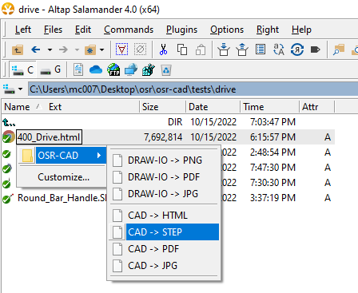
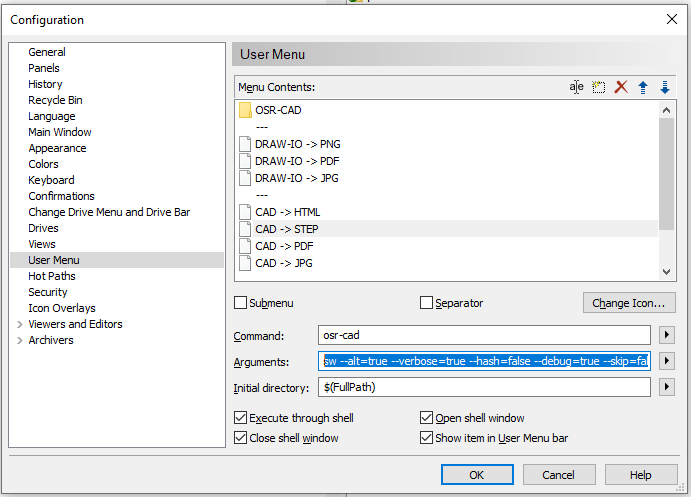

# Integration

## Integration: [Alt-Tap Salamand](https://www.altap.cz/) - Custom Menus

To use pm-cad in custom menus, as follows



1. install pm-cad via ```npm i -g @plastichub/pm-cad```
2. Register a new custom menu (press F9 on any file)



**command** : ```pm-cad```

**Arguments** : ```sw --alt=true --verbose=true --hash=false --debug=true --skip=false --src="$(FullName)"  --dst="&{SRC_DIR}/&{SRC_NAME}.+(step)"```

Here explained, 

```sh

sw                                          # pm-cad command
    --alt=true                              # use alternate tokenizer, '&' instead of '$' to prevent collisions with Alt-Tab's own variable designator
    --verbose=true                          # be verbose
    --hash=false                            # don't create hash files (for caching)
    --debug=true                            # be even more verbose
    --skip=false                            # skip already created files
    --src="$(FullName)"                     # use Alt-Tab's variable for the current selected file
    --dst="&{SRC_DIR}/&{SRC_NAME}.+(step)"  # the output destination path
```

### Remarks

- This will convert any Solidwork supported file format to ```step```. For drawings, assemblies and parts, ```jpg```, ```pdf``` and other 2D formats are supported. Conversions will use the options set in your Solidworks settings.
- Multiple selections will be excecuted serial

## Integration: Custom Grunt Task

```js

// eg: cad-convert.js

const fg = require('fast-glob');

const cad = require('@plastichub/pm-cad/cad/sw-lib');
const cadArgsSanitize = require('@plastichub/pm-cad/argv').sanitize;
const cadArgsSanitizeSingle = require('@plastichub/pm-cad/argv').sanitizeSingle;
const BPromise = require('bluebird');
const {
    option
} = require('grunt');

const path = require('path');
const GLOB_MAIN_ASSEMBLY = "cad/*Global*.+(SLDASM)";

const create_sync_args = (root, product, input_glob, output_glob, options) => {
    const src = `${root}/${product}/${input_glob}`;
    const dst = output_glob;
    return {
        src,
        dst,
        debug: options.debug,
        args: "",
        hash: true,
        verbose: options.verbose,
        skip: options.skip,
        cwd: path.resolve(root)
    }
}

const create_sync_args_single = (root, product, input_glob, output_glob, options) => {
    const src = `${root}/${product}/${input_glob}`;
    const dst = path.resolve(`${root}/${product}/${output_glob}`);
    return {
        src,
        dst,
        debug: options.debug,
        args: "",
        hash: true,
        verbose: options.verbose,
        skip: options.skip,
        cwd: path.resolve(root)
    }
}

const createMeta = (root, product, options, input, output) => {
    const args = create_sync_args(root, product, GLOB_MAIN_ASSEMBLY, output, options);
    const syncArgs = cadArgsSanitize({
        ...args,
        ...options
    });
    return cad.convert(syncArgs);
}
const convert = async (items, options, input, output) => {
    return BPromise.resolve(items).map((target) => {
        return createMeta(options.cwd || '.', target, options, input, output);
    }, {
        concurrency: 1
    });
}


const packAssembly = (root, product, options, input, output) => {
    const args = create_sync_args_single(root, product, GLOB_MAIN_ASSEMBLY, output, options);
    const syncArgs = cadArgsSanitizeSingle({
        ...args,
        ...options
    });
    return cad.pack(syncArgs);
}

const pack = async (items, options, input, output) => {
    return BPromise.resolve(items).map((target) => {
        return packAssembly(options.cwd || '.', target, options, input, output);
    }, {
        concurrency: 1
    });
}


module.exports = function (grunt) {
    const log = grunt.verbose.writeln;
    grunt.registerMultiTask('cad-convert', 'Convert SW files to ... ', function () {
        const done = this.async();
        convert(this.data.items, {
            verbose: grunt.option('verbose') !== undefined ? grunt.option('verbose') : false,
            skip: grunt.option('skip') !== undefined ? grunt.option('skip') : true,
            cwd: grunt.option('cwd'),
            debug: grunt.option('debug') !== undefined ? grunt.option('debug') : false,
        }, this.data.input || GLOB_MAIN_ASSEMBLY, this.data.output).then(() => {
            done();
        });
    });

    grunt.registerMultiTask('cad-pack', 'Pack and go SW assembly files to ... ', function () {
        const done = this.async();
        pack(this.data.items, {
            verbose: grunt.option('verbose') !== undefined ? grunt.option('verbose') : false,
            skip: grunt.option('skip') !== undefined ? grunt.option('skip') : true,
            cwd: grunt.option('cwd'),
            debug: grunt.option('debug') !== undefined ? grunt.option('debug') : false,
        }, this.data.input || GLOB_MAIN_ASSEMBLY, this.data.output).then(() => {
            done();
        });
    });

};
```

Now extend the Grunt configuration for different conversion tasks.

```js

'cad-convert': {
            json: {
                items: products,
                output: '${SRC_DIR}/${SRC_NAME}.+(json)'
            },
            html: {
                items: products,
                output: '${SRC_DIR}/../resources/${SRC_NAME}.+(html)',
                input: "/**/*Global*.+(SLDASM)"
            },
            htmlex: {
                items: [grunt.option('product')],
                output: '${SRC_DIR}/../resources/${SRC_NAME}.+(html)',
                input: "/**/*Global*.+(SLDASM)"
            },
            step: {
                items: products,
                output: '${SRC_DIR}/${SRC_NAME}.+(step)'
            },
            bom: {
                items: products,
                output: '${SRC_DIR}/../resources/${SRC_NAME}.+(xlsx)'
            }
        }
```

Where ```products``` resolves to

```js
const products = [
        'products/injection/myriad-spring'
    ]
```

This example assumes a folder `cad` in `products/injection/myriad-spring`, with an assembly `Global.SLDASM`.

To invoke a particular task: 

```sh
    grunt cad-convert:html
```

Or to bypass the hardcoded 'product' array:

```sh
    grunt cad-convert:htmlex --product='products/injection/myriad-spring`
```

## As batch droplet - single file

1. create a file toHTML.bat with the following content

```batch
@echo off
pm-cad sw --verbose=true --hash=false --debug=true --skip=false --src="%~1"  --dst="${SRC_DIR}/${SRC_NAME}.+(html)"

```

2. drop any SW supported file onto it, to convert it to an eDrawing HTML webview

## As batch droplet - folders

1. create a file toHTMLs.bat with the following content

```batch
@echo off
pm-cad sw --verbose=true --hash=false --debug=true --skip=false --src="%~1/**/*.+(SLDASM|SLDPRT)"  --dst="${SRC_DIR}/${SRC_NAME}.+(html)"
```

2. drop a folder SW supported files onto it, to convert it to an eDrawing HTML webview
