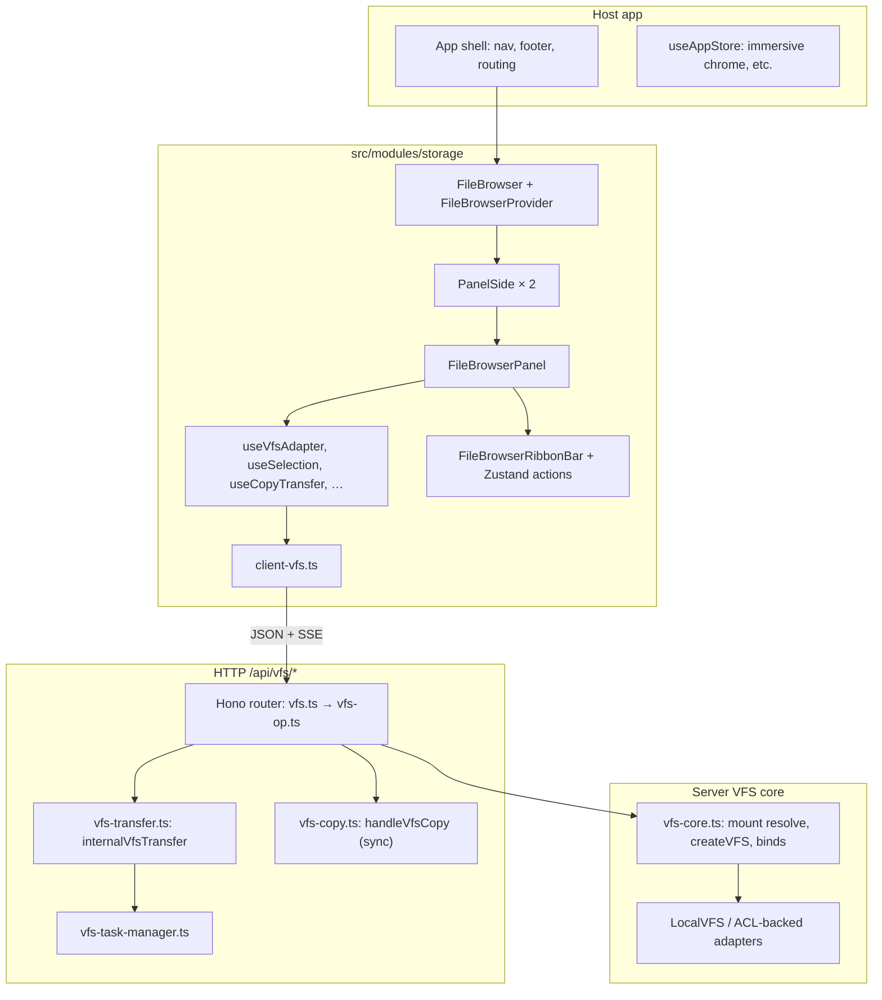
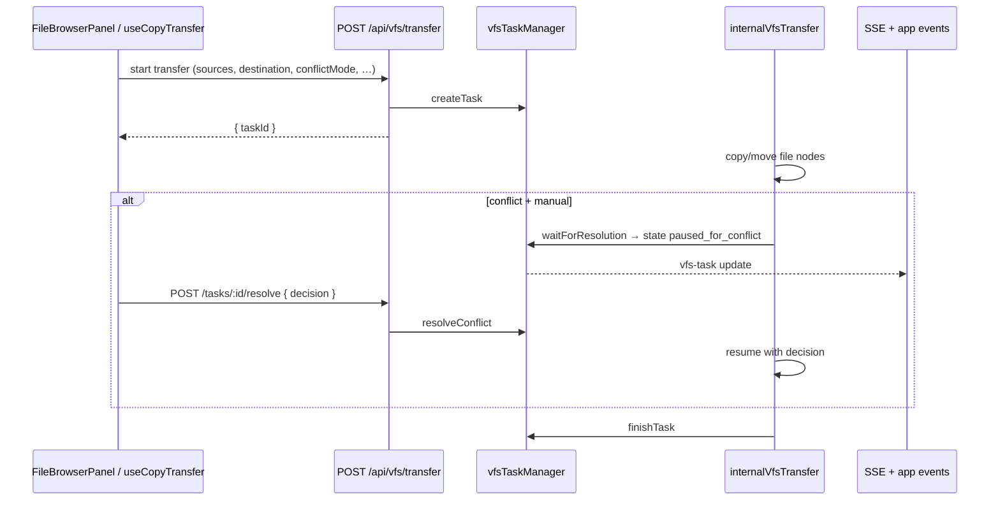
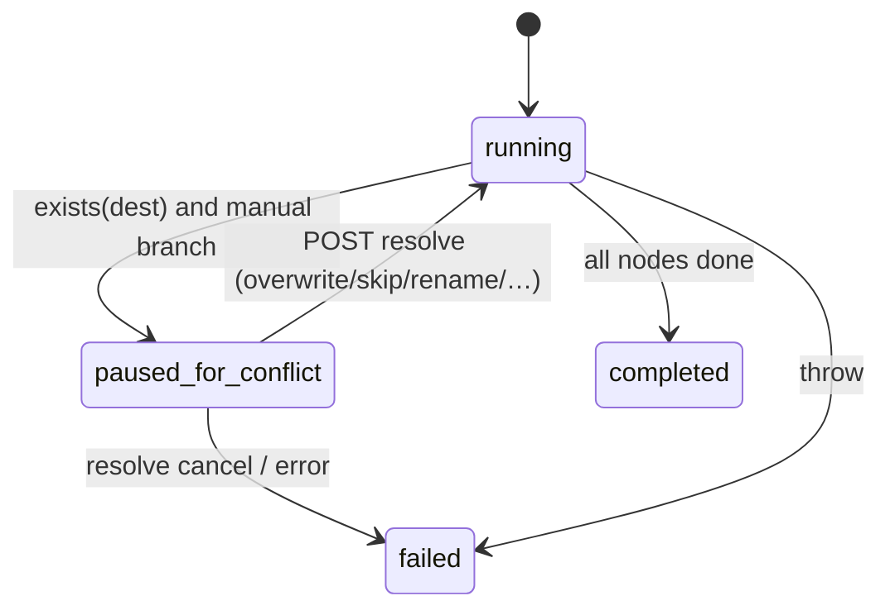

# Storage module — Virtual File Browser

This folder is the **frontend** for a multi-mount virtual filesystem (VFS) backed by the pm-pics server. It is designed to be extracted as a **standalone package** (UI + typed client) with a clear boundary to `@/server/.../storage/api` over HTTP.

---

## 1. Architecture (frontend → backend)

**API base path:** all client calls use **`/api/vfs/...`** (see `vfsUrl()` in `helpers.ts`).

---

## 2. Main entry points

| Component | Role |
|-----------|------|
| **`FileBrowser`** | Wraps **`FileBrowserProvider`**, parses **URL** (`/app/filebrowser/:mount/*`) and query params when `disableRoutingSync` is false. |
| **`FileBrowserProvider`** | Global state: **dual/single layout**, **left/right panels**, **active panel**, **view mode**, **chrome** (`toolbar` \| `ribbon`), **link panes**. |
| **`FileBrowserInner`** | Layout: **LayoutToolbar** (non-ribbon), **FileBrowserRibbonBar** (ribbon desktop), **ResizablePanelGroup** with **`PanelSide`** left/right. |
| **`PanelSide`** | Tabs per side, wires **`FileBrowserPanel`** with `mount` / `path` / `panelId` / `browserSide`. |
| **`FileBrowserPanel`** | Single pane: listing, tree, preview, drag‑drop, **Copy To** flow, search, VFS action registration. |

---

## 3. `FileBrowser` props (wrapper)

| Prop | Type | Notes |
|------|------|--------|
| `allowPanels` | `boolean?` | Dual-pane; can be overridden by URL `?panels=0/1`. |
| `mode` | `'simple' \| 'advanced'?` | UI density; URL `?mode=`. |
| `index` | `boolean?` | Load `readme.md` in directory; URL `?index=`. |
| `disableRoutingSync` | `boolean?` | **Playground** / embedded: no URL sync. |
| `initialMount` | `string?` | Seed mount when not from URL. |
| `initialChrome` | `'toolbar' \| 'ribbon'?` | Ribbon vs toolbar chrome. |
| `onSelect` | `(node, mount?) => void` | Selection callback. |

**URL contract (when routing sync on):** `/app/filebrowser/{mount}/{path...}` plus query: `view`, `toolbar`, `showExplorer`, `showPreview`, `panels`, `glob`, `folders`, `search`, `fullText`, `file`, etc.

---

## 4. `FileBrowserPanel` props (single pane)

| Prop | Default / notes |
|------|------------------|
| `mount`, `path`, `glob` | Controlled mount/path; `machines`, `/`, `*.*` typical. |
| `mode` | `simple` \| `advanced`. |
| `viewMode` | `list` \| `thumbs` \| `tree`. |
| `showToolbar` | Per-panel toolbar (when ribbon is off or mobile). |
| `canChangeMount` | Show mount dropdown (when not `jail`). |
| `allowFileViewer`, `allowLightbox`, `allowPreview`, `allowDownload` | Feature gates. |
| `jail` | Restrict navigation to `path` subtree (mount switching off). |
| `index` | Auto-fetch `readme.md` for directory. |
| `allowFallback` | Show empty-state fallback when no readme. |
| `autoSaveId` | localStorage key for split sizes / prefs. |
| `showFolders`, `showExplorer`, `showPreview`, `showTree` | Visibility. |
| `onPathChange`, `onMountChange`, `onSelect`, `onFilterChange`, `onSearchQueryChange` | Controlled integration. |
| `searchQuery` / `onSearchQueryChange` | Inline search mode. |
| `allowCopyAction` | **Copy To** (server transfer). |
| `panelId` | **Required** for Zustand VFS actions (`vfs/panel/<id>/…`). |
| `browserSide` | `'left'` \| `'right'` — **New tab** target, layout actions. |

---

## 5. Backend HTTP surface (`server/.../vfs.ts`)

`vfsApi` is mounted at **`/vfs`**; the app typically prefixes **`/api`**, so routes are **`/api/vfs/...`**.

| Method | Path | Handler module (via `vfs-op.ts`) |
|--------|------|-----------------------------------|
| GET | `/mounts` | `vfs-mounts` |
| GET | `/ls/*` | `vfs-list` |
| GET | `/stat/*`, `/get/*` | `vfs-read` |
| POST | `/write/*`, `/mkdir/*` | `vfs-mutate` |
| DELETE | `/rmfile/*`, `/rmdir/*` | `vfs-mutate` |
| GET | `/search` | `vfs-search` |
| POST | `/transfer` | **`vfs-transfer`** → starts async task |
| POST | `/compress` | `vfs-read` |
| POST | `/clear-index/*` | `vfs-index-admin` |
| GET | `/tasks/:id/stream` | SSE task updates |
| POST | `/tasks/:id/resolve` | **Conflict resolution** |
| GET | `/tasks/:id` | Task poll |

**Legacy sync copy:** **`handleVfsCopy`** (`vfs-copy.ts`) is registered as **`POST /api/vfs/copy`** (see `server/src/products/storage/index.ts` + `vfs-routes.ts`). The Hono `vfsApi` object in `vfs.ts` does **not** attach `/copy`; that route lives next to the OpenAPI bundle.

---

## 6. Copy / move / delete: two client paths

### 6.1 Async transfer (what the UI uses)

- **`client-vfs.ts`:** `vfsStartTransferTask` → **`POST /api/vfs/transfer`** with body matching server expectations (`operation`, `sources`, `destination`, `conflictMode`, `conflictStrategy`, glob patterns, etc.).
- Progress / conflicts: **`useCopyTransfer`** listens to **`StreamContext`** for `vfs-task` events; **`vfsGetTaskStatus`** as fallback; **`vfsResolveTaskConflict`** → **`POST /api/vfs/tasks/:id/resolve`**.

### 6.2 Legacy synchronous copy (`vfs-copy.ts`)

- **`handleVfsCopy`:** runs **`internalVfsTransfer(..., { syncCopyMode: true })`** and **awaits** completion.
- Used for **simple HTTP clients** and tests that expect a **single JSON response** instead of a task id.
- **409** if conflict remains (paused) or error message contains `Conflict`.

### 6.3 `internalVfsTransfer` (`vfs-transfer.ts`) — conflict model

**Request fields (subset):**

| Field | Meaning |
|-------|---------|
| `operation` | `copy` \| `move` \| `delete` |
| `sources[]` | `{ mount, path }` |
| `destination` | `{ mount, path }` (not for delete) |
| `conflictMode` | `auto` (default) or **`manual`** → can pause for user |
| `conflictStrategy` | `error` \| `overwrite` \| `skip` \| `rename` \| `if_newer` |
| `includePatterns` / `excludePatterns` / `excludeDefault` | Tree glob filtering (`collectCopyNodes`) |

**Behavior:**

1. Resolves **destination** mount, **sanitizes** paths, **plans** all file nodes (directories created, files copied with `readfile` → `writefile`; **move** deletes source after write).
2. **Directory vs file** conflicts: if a path exists and types disagree, **manual** mode may call **`vfsTaskManager.waitForResolution`** with `{ source, destination, suggestedPath }`.
3. **File copy** when `exists(targetPath)`:
   - **Auto:** apply `conflictStrategy` (skip, overwrite via rm+write, rename path, `if_newer` compares mtime).
   - **Manual** (`conflictMode === 'manual'` and strategy not already overwrite/skip only): **`waitForResolution`** → task **`paused_for_conflict`** until **`resolve`**.
4. **Allowed decisions** (`handleTaskResolve`): `overwrite`, `overwrite_all`, `skip`, `skip_all`, `rename`, `if_newer`, `cancel`, `error`.

**Special case — `syncCopyMode` + manual + overwrite:** first conflicting file can **set** `paused_for_conflict` without `waitForResolution` (early return for legacy `/copy`).

### 6.4 `vfs-task-manager.ts`

- **Singleton** task store: `running` → `paused_for_conflict` → `completed` \| `failed`.
- **`waitForResolution`:** sets state + conflict payload, **blocks** until **`resolveConflict`** receives a decision.
- **`finishTask`:** clears pending deferreds; emits **`app-update`** / **`vfs-task`** for SSE.

---

## 7. Core VFS resolution (`vfs-core.ts`)

- **`resolveMount` / `resolveMountByName`:** mount + ACL owner.
- **`createVFS`:** returns an **`IVFS`** implementation (e.g. `LocalVFS` wrapped with ACL).
- **Binds:** virtual path joins between mounts (`resolveBind`, …).

---

## 8. Frontend module map (for extraction)

| Area | Files |
|------|--------|
| Shell | `FileBrowser.tsx`, `FileBrowserContext.tsx`, `PanelSide.tsx`, `LayoutToolbar.tsx`, `FileBrowserRibbonBar.tsx` |
| Pane | `FileBrowserPanel.tsx`, `FileListView.tsx`, `FileGridView.tsx`, `FileTree.tsx` |
| Commands | `file-browser-commands.ts`, `useRegisterVfsPanelActions.ts`, `VfsContextMenu.tsx` |
| Data | `hooks/useVfsAdapter.ts`, `hooks/useSelection.ts`, `hooks/useCopyTransfer.ts`, … |
| API client | `client-vfs.ts`, `helpers.ts` (`vfsUrl`) |
| Types | `types.ts` |
| Server (sibling package) | `server/src/products/storage/api/vfs*.ts` |

**Dependencies to keep explicit when packaging:** `react`, `react-router`, `@tanstack` (if used), `zustand` (actions + app store), **`/api/vfs`** contract, auth headers (`getAuthHeaders`), optional **`StreamContext`** for live task events.

---

## 9. Diagram — conflict resolution (manual mode)

---

## 10. References

- **Router wiring:** `server/src/products/storage/api/vfs-routes.ts` (how app mounts `vfsApi` and `/copy`).
- **Shared types:** `@polymech/shared` `VfsCopyRequest` / responses (used by `client-vfs.ts`).
- **Immersive UI:** `useAppStore.fileBrowserImmersive` + `App.tsx` (hide chrome — not browser Fullscreen API).
